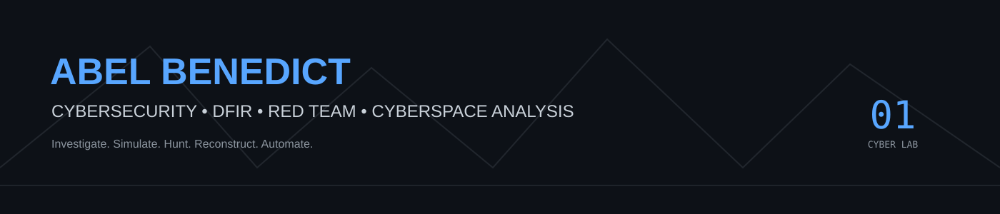
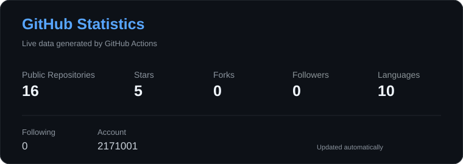
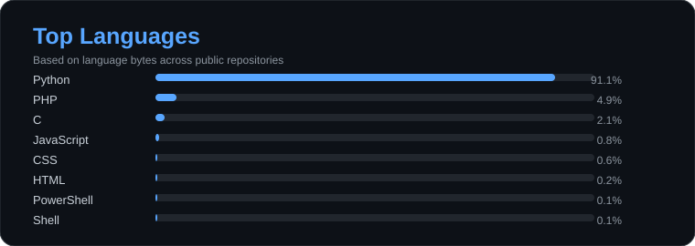
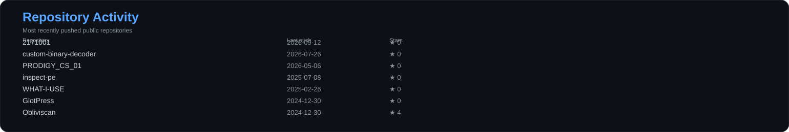

# Abel Benedict | Cybersecurity

<p align="center">
  
</p>

<p align="center">
  <strong>DFIR • Red Team Operations • Cyberspace Analysis • Security Engineering</strong>
</p>

<p align="center">
  <a href="https://www.linkedin.com/in/abel-benedict-364a911b9/"></a>
  <a href="https://tryhackme.com/p/anon.techy111"></a>
  <a href="https://play.picoctf.org/users/abelbenedict"></a>
</p>

---

## 🧠 The Mission

I am an emerging **Cyber Beast** building toward a career at the intersection of **Digital Forensics & Incident Response (DFIR), Red Team Operations, and Cyberspace Analysis**.

My objective is not to stop at SOC Tier 1. A SOC role is a valuable operational foundation for me — a place to sharpen detection, investigation, telemetry, and incident-response skills while progressing toward deeper offensive and forensic work.

I am interested in understanding the complete attack lifecycle:

**Reconnaissance → Initial Access → Execution → Persistence → Privilege Escalation → Lateral Movement → Collection → Exfiltration → Detection → Investigation → Forensic Reconstruction**

The goal is simple:

> **Understand how systems are attacked, how attacks are detected, how evidence survives, and how the entire operation can be reconstructed.**

---

## ⚔️ Core Domains

| Domain | Focus |
|---|---|
| 🔎 **DFIR** | Disk, memory, endpoint and network investigation; IOC extraction; incident reconstruction |
| 🔴 **Red Team Operations** | Reconnaissance, vulnerability assessment, web application testing, C2 concepts and adversary simulation |
| 🌐 **Cyberspace Analysis** | OSINT, attack-surface discovery, Shodan/Censys-driven reconnaissance and infrastructure analysis |
| 🧬 **Reverse Engineering** | Malware triage, behavioral analysis, static/dynamic analysis and Windows/Linux internals |
| 🛡️ **Threat Hunting** | PCAP analysis, telemetry, anomaly detection and detection engineering |
| 🐞 **Bug Hunting** | Web application security, OWASP Top 10, secure code assessment, recon and smart fuzzing |
| ⚙️ **Security Automation** | Python, PowerShell and Bash for repeatable security workflows |

---

## 🧪 Cyber Lab

My learning environment is built around isolated virtualized systems and deliberately controlled experimentation.

**Primary environment**

- VMware Workstation Pro
- WSL Ubuntu
- Kali Linux
- REMnux
- Security Onion
- Windows virtual machines
- Isolated malware-analysis environments
- Network-monitoring and chaos-testing environments

The lab is where theory becomes evidence:

```text
┌─────────────────────────────────────────────────────────┐
│                    CYBER LAB                            │
├─────────────────┬─────────────────┬─────────────────────┤
│ OFFENSE         │ DEFENSE         │ FORENSICS           │
│                 │                 │                     │
│ Kali            │ Security Onion  │ Volatility          │
│ Burp Suite      │ Wireshark       │ FTK Imager          │
│ Nmap            │ Suricata        │ Autopsy             │
│ Metasploit      │ Elastic Stack   │ strace              │
│ C2 Frameworks   │ Log Analysis    │ IOC Reconstruction  │
└─────────────────┴─────────────────┴─────────────────────┘
```

---

## 🚀 Dream Project — Ultimate AI-Integrated Pentest Platform

The long-term project I want to build is an **AI-integrated Ultimate Pentest Tool** that unifies three perspectives of cybersecurity:

### 🔴 OFFENSE
- Intelligent reconnaissance
- Attack-surface mapping
- Automated enumeration
- Smart fuzzing
- Vulnerability discovery
- Controlled exploitation workflows

### 🔵 DEFENSE
- Detection engineering
- Telemetry collection
- Threat hunting
- IOC correlation
- Alert generation
- Defensive validation

### 🟣 FORENSICS
- Evidence collection
- Memory analysis
- Artifact extraction
- Timeline reconstruction
- IOC generation
- Incident investigation

The ambition is to create a platform where **offensive testing produces defensive intelligence and forensic evidence** rather than treating these disciplines as isolated worlds.

---

## 🛠️ Technical Arsenal

### Offensive Security
`Burp Suite` `Nmap` `Metasploit` `Nessus` `Cobalt Strike` `Sliver` `Mythic` `Empire` `BloodHound` `evilginx2`

### Cyberspace Reconnaissance
`Shodan` `Censys` `OSINT` `Attack-Surface Discovery`

### DFIR & Malware Analysis
`Volatility` `Autopsy` `FTK Imager` `ClamAV` `strace` `IOC Analysis`

### Network Security & Threat Hunting
`Wireshark` `Suricata` `Elastic Stack` `ELK Stack`

### Development & Automation
`Python` `PowerShell` `Bash`

### Systems
`Linux` `Windows` `WSL` `RHEL`

---

## 🔬 Selected Projects

### Malware Analysis & Cyber Defense
Hands-on malware analysis across Windows and Linux environments using **ClamAV, Volatility and strace**, with IOC documentation and remediation guidance.

### Centralized Security Logging
Configured **ELK Stack** for centralized logging and developed automation workflows for near-real-time security-log analysis and anomaly detection.

### Blockchain Certificate Generation & Validation
Developed a blockchain-based certificate generation and validation system using **Ethereum, smart contracts and web3.js**.

### Security Automation & Research
A growing collection of scripts, labs and experiments focused on security automation, system analysis, offensive testing, defensive telemetry and forensic investigation.

---

## 🏆 Certifications & Milestones

- **Red Hat Certified System Administrator (RHCSA EX200V9)** — Feb 2024
- **Google Cybersecurity Professional Certificate** — Jun 2024
- **TryHackMe Advent of Cyber 2024** — Dec 2024
- **TryHackMe:** 28 badges and 379 rooms completed at the time recorded in my resume
- **Bug Hunting:** Ongoing freelance web application security and secure-code assessment work

---

## 📊 GitHub Analytics

<p align="center">
  
  
</p>

<p align="center">
  
</p>

---

## 📚 Current Direction

```text
SOC Operations
      │
      ├── Detection & Telemetry
      │
      ├── Threat Hunting
      │
      ├── Incident Response
      │
      ▼
     DFIR
      │
      ├── Memory Forensics
      ├── Malware Analysis
      ├── Network Forensics
      └── Endpoint Investigation
      │
      └──────────────┐
                     ▼
              Red Team Operations
                     │
              Cyberspace Analysis
                     │
                     ▼
             Security Engineering
```

I want to understand the **whole ecosystem**, not just one layer of it.

---

## 🔗 Find Me

- **GitHub:** https://github.com/2171001
- **LinkedIn:** https://www.linkedin.com/in/abel-benedict-364a911b9/
- **TryHackMe:** https://tryhackme.com/p/anon.techy111
- **picoCTF:** https://play.picoctf.org/users/abelbenedict

---

<p align="center">
  <strong>Explore the repositories.</strong><br>
  The real work lives in the code, labs, experiments and evidence.
</p>
